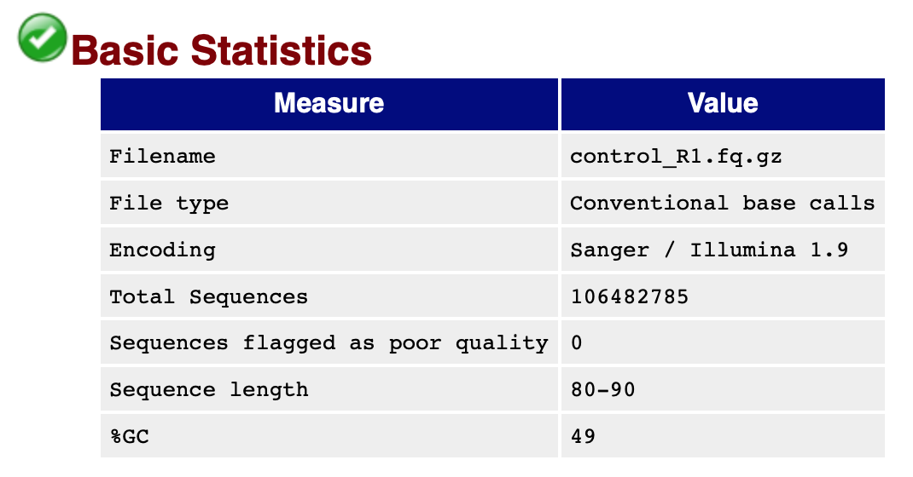
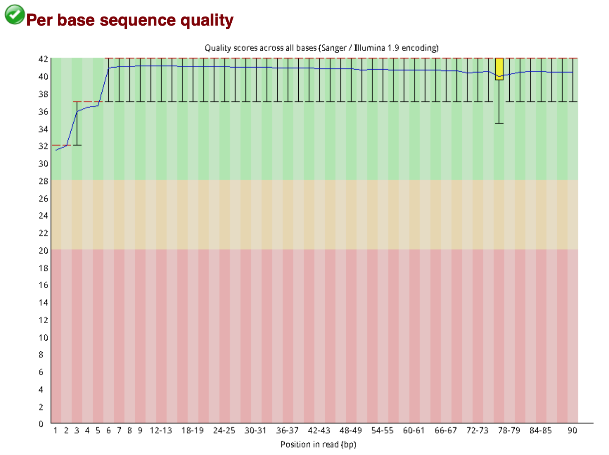
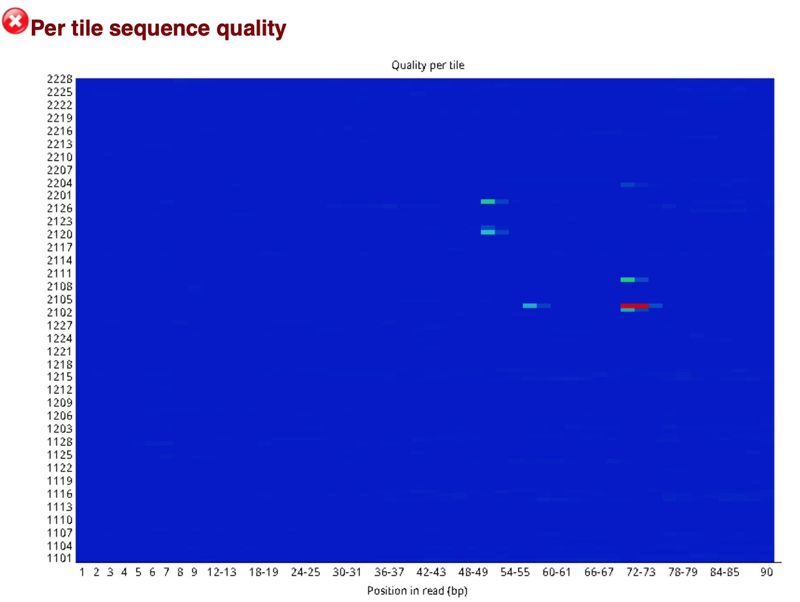
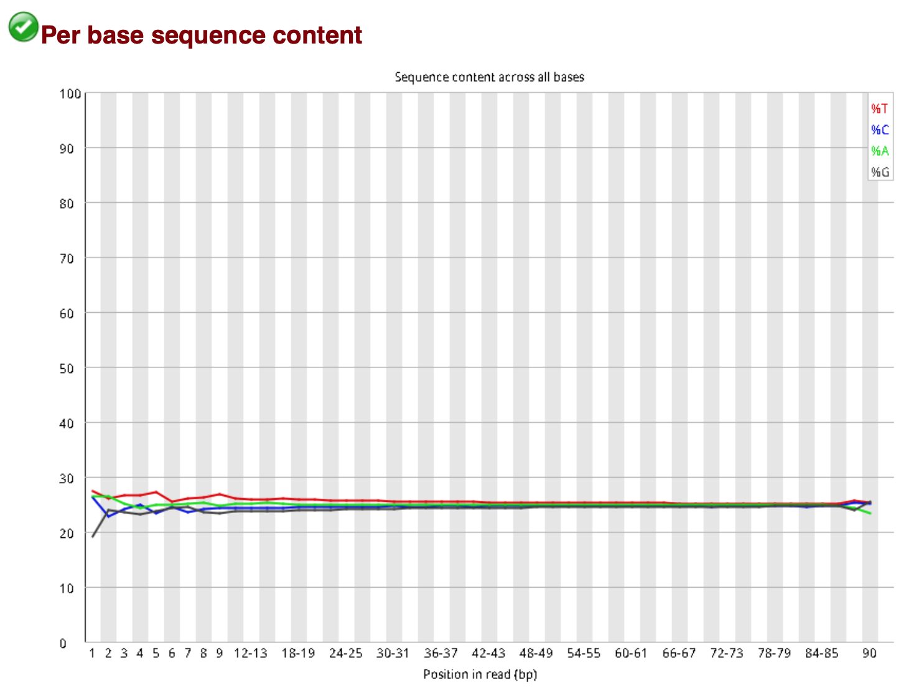
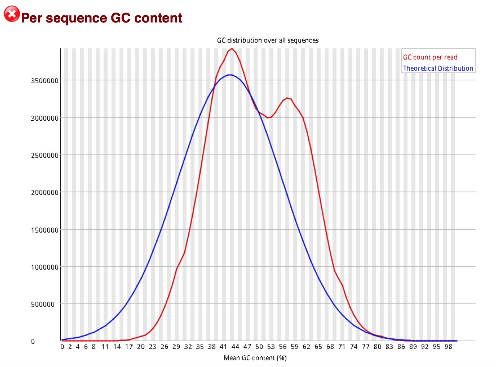
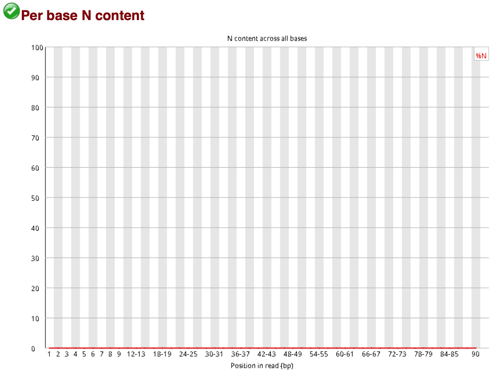
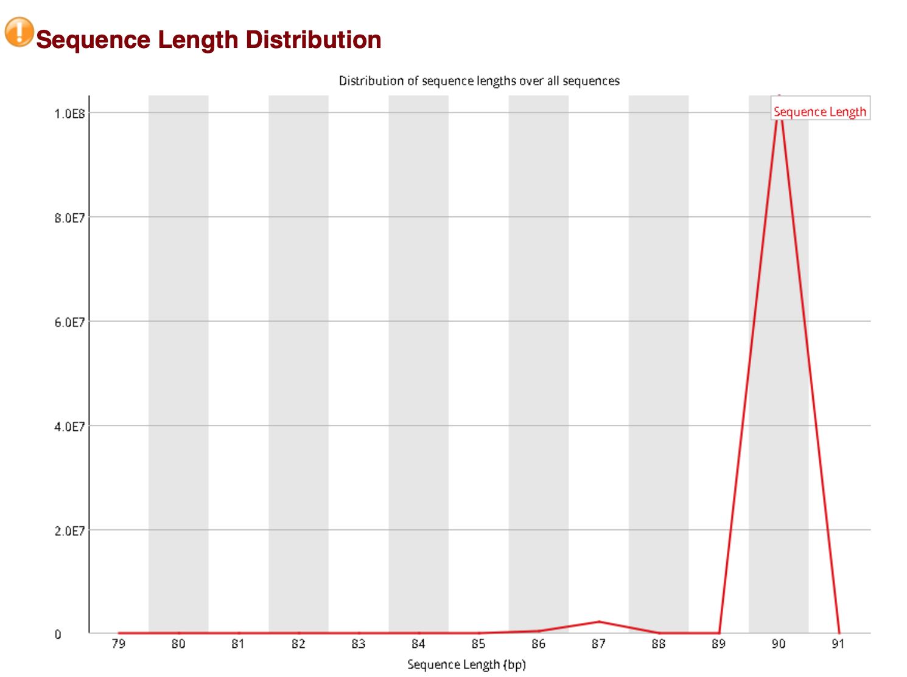
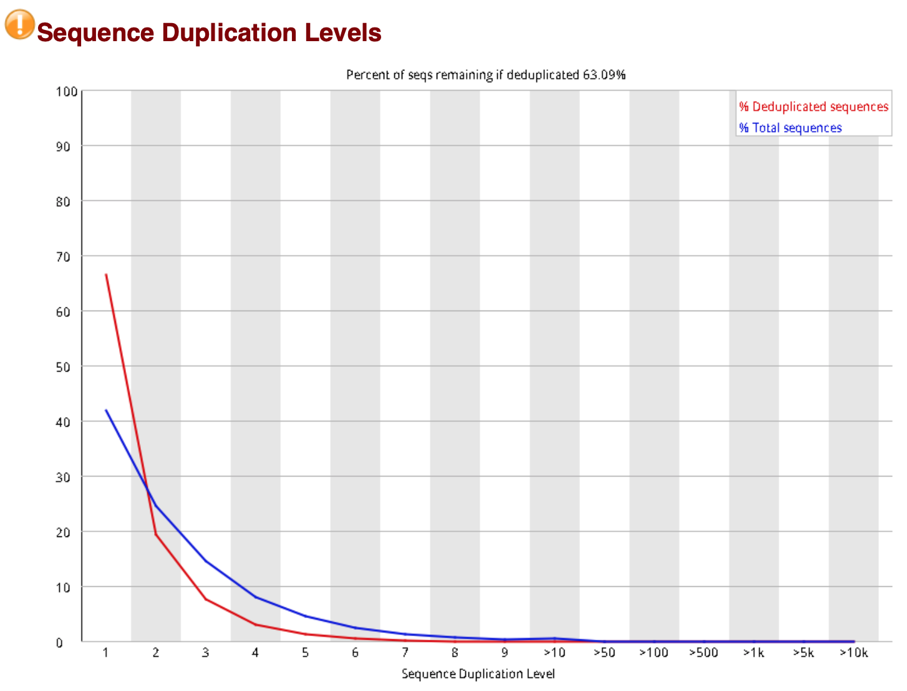
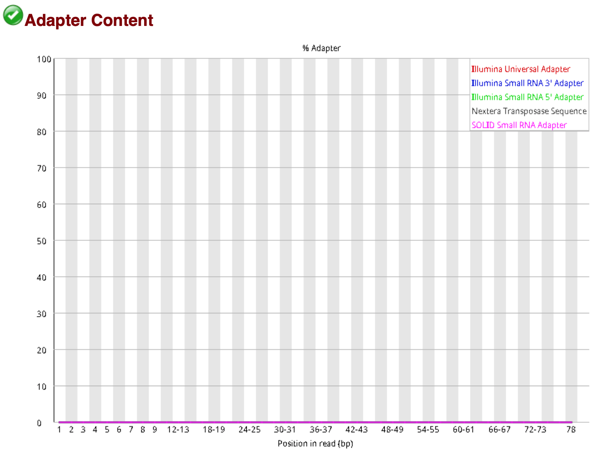
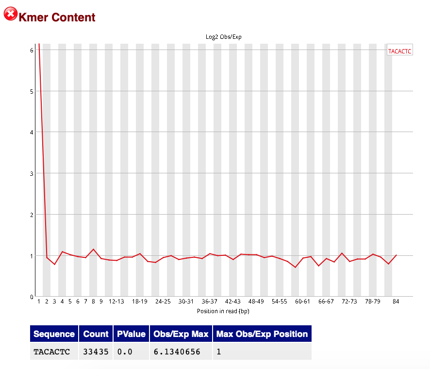

Manual: [Fastqc](http://www.bioinformatics.babraham.ac.uk/projects/fastqc/), [Analysis modules]([http://www.bioinformatics.babraham.ac.uk/projects/fastqc/Help/3%20Analysis%20Modules/](http://www.bioinformatics.babraham.ac.uk/projects/fastqc/Help/3 Analysis Modules/))

也可参考: [Fastqc安装与使用](http://wap.sciencenet.cn/blog-3406804-1161193.html?mobile=1)

##### Introduction

A quality control tool for high throughput sequence data.

e.g. 

```shell
.../FastQC/fastqc xxx.fq.gz
```

##### Analysis modules

1. ##### Basic statistics

   

   - Total Sequences：指reads的数量
   - Sequence length：指测序的长度
   - %GC：GC含量，全基因组范围内或在特定基因组序列内的4种碱基中，鸟嘌呤和胞嘧啶所占的比率。 

2. ##### Per base sequence quality

   

   - 横轴: 是测序序列第1个碱基到第90个碱基
   - 纵轴: 质量得分，Q = -10*log10（error P）即20表示0.01的错误率，30表示0.001
   - 红线表示中值
   - 图中蓝色的细线是各个位置的平均值的连线

3. ##### Per tile sequence quality

   

   - This graph will only appear in your analysis results if you're using an Illumina library   which retains its original sequence identifiers. 
   - Encoded in these is the flowcell tile from which each read came. The graph allows you to look at the quality scores from each tile across all of your bases to see ***if there was a loss in quality associated with only one part of the flowcell***.
   - The colours are on a cold to hot scale, with cold colours being positions where the quality was at or above the average for that base in the run, and hotter colours indicate that a tile had worse qualities than other tiles for that base. 

4. ##### Per sequence quality scores

   

   * 该图横轴是0-40，表示Q值, 序列长度为90bp，那么这90个位置每个位置Q值的平均值就是这条reads的质量值
   * 纵轴是每个值对应的reads数目
   * 这个样本数据，测序结果主要集中在30-40中，证明测序质量很好

5. ##### Per base sequence content

   

   * 横轴是1 - 90 bp；纵轴是百分比
   * 图中四条线代表A T C G在每个位置平均含量
   * 理论上来说，A和T应该相等，G和C应该相等，但是一般测序的时候，刚开始测序仪状态不稳定，很可能出现上图开头的情况。

6. ##### Per sequence GC content

   

   * 横轴是0 - 100%； 纵轴是每条序列GC含量对应的数量
   * 蓝色的线是程序根据经验分布给出的理论值，红色是真实值，两个应该比较接近才比较好

7. ##### Per base N content

   

   * 当测序仪器不能辨别某条reads的某个位置都是ATCG哪个碱基时，就会产生"N"，对所有reads的每个位置统计N的比率。

8. ##### Sequence Length Distribution

   

   * 每次测序仪测出来的长度在理论上应该是完全相等的，但是总会有一些偏差.
   * 比如此图中，90bp是主要的，但是还是有少量的87bp的长度

9. ##### Sequence Duplication Levels

   
   
   * In a diverse library most sequences will occur only once in the final set. A low level of duplication may indicate a very high level of coverage of the target sequence, but a high level of duplication is more likely to indicate some kind of enrichment bias (eg PCR over amplification).
   * The blue line takes the full sequence set and shows how its duplication levels are distributed. In the red plot the sequences are de-duplicated and the proportions shown are the proportions of the deduplicated set which come from different duplication levels in the original data.
   * :warning:This module will issue a warning if non-unique sequences make up more than 20% of the total. A warning or error in this module is simply a statement that you have exhausted the diversity in at least part of your library and are re-sequencing the same sequences.

10. Adapter Content

11. Kmer Content
      

   * This module will issue a warning if any k-mer is imbalanced with a binomial p-value < 10^-5.
   * This module is now diabled by default(from v.0.11.6 forwards) *This is what release notes say: There is one major change which is that by default we now disable the kmer module. With the inclusion of the adapter plot the value of the information in the Kmer plot is often not great, and it is easy to confound it if there are any over-represented sequences, or primer compositional bias. Overall therefore we consider it best to not routinely include this module.*

