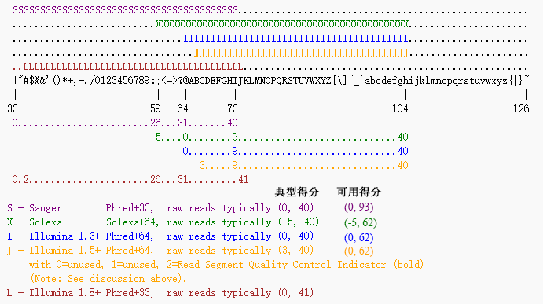

Manual: [Trimmomatic](http://www.usadellab.org/cms/index.php?page=trimmomatic)

也可参考: [Trimmomatic详解](http://www.biotrainee.com/thread-1484-1-1.html)

Paper: Bolger, A. M., Lohse, M., & Usadel, B. (2014). Trimmomatic: A flexible trimmer for Illumina Sequence Data. *Bioinformatics*, btu170.

##### Introduction

Trimmomatic performs a variety of useful trimming tasks for illumina paired-end and single ended data.The selection of trimming steps and their associated parameters are supplied on the command line.

The current trimming steps are:

- ILLUMINACLIP: Cut adapter and other illumina-specific sequences from the read.
- **SLIDINGWINDOW**: Perform a sliding window trimming, cutting once the average quality within the window falls below a threshold.
- **LEADING**: Cut bases off the start of a read, if below a threshold quality
- **TRAILING**: Cut bases off the end of a read, if below a threshold quality
- CROP: Cut the read to a specified length
- HEADCROP: Cut the specified number of bases from the start of the read
- **MINLEN**: Drop the read if it is below a specified length
- TOPHRED33: Convert quality scores to Phred-33
- TOPHRED64: Convert quality scores to Phred-64

 ##### Paired-end格式

```shell
java -jar <path to trimmomatic.jar> PE [-threads <threads] [-phred33 | -phred64] [-trimlog <logFile>] <input 1> <input 2> <paired output 1> <unpaired output 1> <paired output 2> <unpaired output 2> <step 1> ...
```

e.g. Paired-end

```shell
java -jar trimmomatic-0.35.jar PE -phred33 input_forward.fq.gz input_reverse.fq.gz output_forward_paired.fq.gz output_forward_unpaired.fq.gz output_reverse_paired.fq.gz output_reverse_unpaired.fq.gz ILLUMINACLIP:TruSeq3-PE.fa:2:30:10 LEADING:3 TRAILING:3 SLIDINGWINDOW:4:15 MINLEN:36
```

This will perform the following:

- Remove adapters (ILLUMINACLIP:TruSeq3-PE.fa:2:30:10)
- Remove leading low quality or N bases (below quality 3) (LEADING:3)
- Remove trailing low quality or N bases (below quality 3) (TRAILING:3)
- Scan the read with a 4-base wide sliding window, cutting when the average quality per base drops below 15 (SLIDINGWINDOW:4:15)
- Drop reads below the 36 bases long (MINLEN:36)

| Option          | Result                                                       |
| --------------- | ------------------------------------------------------------ |
| PE/SE           | paired-end/single-end                                        |
| -threads NUMBER | Indicates the number of threads to use, which improves performance on multi-core computers |

##### Warining

**注1**: 之前已经使用cutadapt去接头，则不进行ILLUMINACLIP步骤

**注2**: 从0.32版本后的Trimmomatic可自行判断输入文件的质量得分格式, 不需要进行设置. 之前版本默认phred64.  若需要判断使用的数据使用什么质量得分格式, 可读取.fastq文件前四行, 根据最后一行质量字符的范围进行判断.

可参考: [Fastq格式说明](https://blog.csdn.net/huyongfeijoe/article/details/51613827)



**:warning: 注3**: 要根据reads长度修改MINLEN参数 